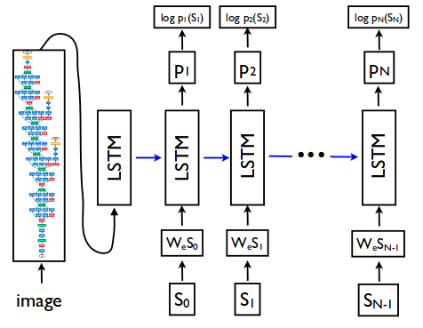

## Word recognition using Recursive CNNs, LSTMS, and attentional modelling

RNN model takes its inspiration from [Show and Tell](https://arxiv.org/abs/1411.4555)

The training is done on [Synthetic Dataset](http://www.robots.ox.ac.uk/~vgg/data/text/)

Input to the network:

a) Input to RCNN: Greyscale image of dimension 32X100

b) Input to LSTM: Character vector and Image features extracted from CNN

Following things are tested:

1. Recursive Neural Network for increasing the depth of the CNN without increasing number
   parameters. For now two iterations are tried in the recursive layer, in total giving extra 8
   layers, that increases the non linearity by keeping the number of parameters constant.

2. LSTM for the language modeling task. GRU can be used also, that will give faster computation
   and requires lesser memory.

This network can be used for other image captioning, only difference is that the input to the lstm
will be character vectors rather than word vectors.

### Future work:

Attention modeling to focus selectively on part of image 

### License

The code is released under a [revised (3-clause) BSD License](http://directory.fsf.org/wiki/License:BSD_3Clause).
